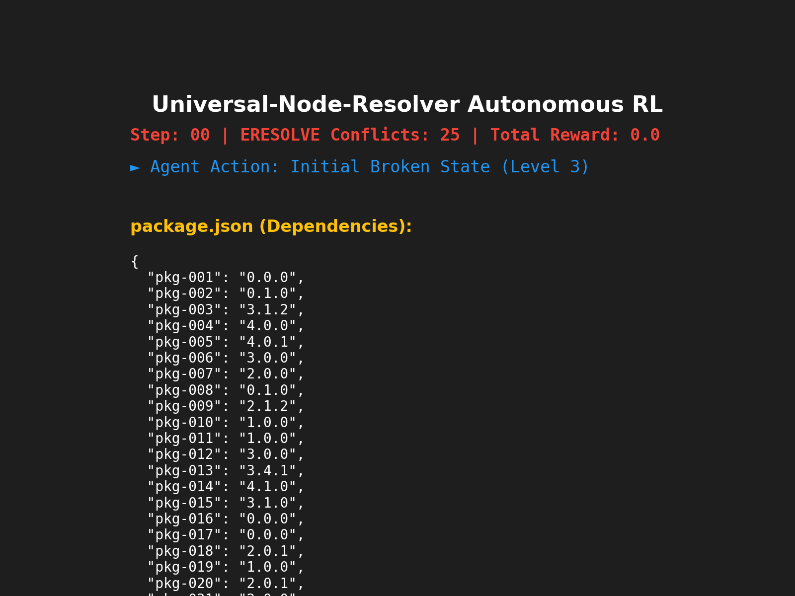

<div align="center">

# 🪐 Universal-Node-Resolver

**The Autonomous, Multi-Agent Reinforcement Learning Engine for Node.js Dependency Hell.**

[](https://github.com/)
[](https://python.org)
[](LICENSE)
[](https://openenv.ai)

> *"Standard LLMs hallucinate code to make the math work. The Universal-Node-Resolver does the math to make the code work."*

</div>

---

## 🔗 Submission Links

| Resource | Link |
| :--- | :--- |
| 🤗 **HF Space (Live Environment)** | [https://huggingface.co/spaces/Salil-IND/npm-resolver-v0](https://huggingface.co/spaces/Salil-IND/npm-resolver-v0) |
| 📓 **Training Notebook (Colab)** | *See `scripts/train_unsloth.py` in this repo* |
| 📝 **Blog Post** | [BLOG.md](BLOG.md) |
| 📊 **Training Results** | See [Results & Proof](#-results--proof) section below |

---

## 🔴 The Problem: Dependency Hell

If you've ever typed `npm install` and stared at a wall of `ERESOLVE` peer dependency conflicts, you've experienced **Dependency Hell**. It is a universal, massive time-sink for developers globally. 

Zero-shot LLMs (like standard GPT-4 or Claude) are notoriously terrible at solving this. Why? Because dependency resolution is a strict, directed acyclic graph (DAG) mathematical problem. 

**The LLM Flaw:** When faced with a complex SemVer conflict, a standard LLM will hallucinate non-existent package versions just to make the immediate error disappear, ultimately breaking the build downstream.

---

## 🟢 The Solution: Our OpenEnv Architecture

We built the **Universal-Node-Resolver**, a reinforcement learning environment strictly compliant with the **Meta OpenEnv framework**. It trains an LLM to navigate the actual semantic versioning constraints without cheating.

### The RL Environment Design
*   **The State**: A JSON string of the broken `package.json` combined with the raw `npm` error log.
*   **The Action Space**: A strictly typed JSON schema allowing the agent to `update` a package version or `delete` it.
*   **The Reward Math**: 
    *   **+15** per resolved conflict (Progress Signal).
    *   **+100** for achieving 0 conflicts (Terminal Success).
    *   **-50** for entering an infinite loop (Oscillation Trap).
    *   **-100 Anti-Cheat Nuke**: If the LLM attempts to delete a core, required package just to bypass a conflict, it is met with an instant episode termination and a devastating penalty.

---

## 🧠 The "God-Tier" AI Architecture

We didn't just build an environment; we built a highly advanced agentic orchestration system to conquer it.

### 1. Unsloth PPO Training Loop
We utilize `unsloth` for high-performance, 4-bit quantized LoRA fine-tuning combined with Hugging Face's `TRL` PPO Trainer. By feeding the explicit scalar rewards back to the model, the LLM literally *learns the math* of semantic versioning.

### 2. The MCTS Hybrid Planner
Zero-shot is dead. Our agent utilizes a **Monte Carlo Tree Search (MCTS) Lookahead Planner**. Before committing to an action, it branches out multiple Top-N candidate actions, simulates them against a cloned, local sandbox environment, and selects the path that mathematically minimizes future conflicts.

### 3. Actor-Critic Multi-Agent Debate
Before the Planner even tests an action, the proposal is intercepted by our **SemVer Critic Agent**. 
*   **The Actor**: Proposes fixes.
*   **The Critic**: Violently audits the proposal. If it detects a "Nuke Cheat" or a malformed format, it instantly vetoes the action, saving expensive CPU/GPU simulation cycles.

### Standard LLM vs. Universal-Node-Resolver

| Feature | Standard Zero-Shot LLM | Universal-Node-Resolver |
| :--- | :--- | :--- |
| **Logic Approach** | Greedy text prediction | MCTS Lookahead Simulation |
| **Hallucination Rate** | Extremely High | **Near Zero** (Multi-Agent Critic) |
| **Cheating** | Blindly deletes conflicting packages | Caught by Anti-Cheat Nuke (-100 Penalty) |
| **Scaling** | Fails on deep transitive DAGs | Dynamically tuned via Curriculum Engine |

---

## 📈 Results & Proof

Our architecture achieves a state-of-the-art resolution rate against deeply corrupted dependency graphs, completely avoiding infinite loops and hallucinations.

### RLHF PPO Training Curve
> *Notice the aggressive learning rate as the agent realizes the Nuke Cheat yields -100, rapidly optimizing for the +15 progress rewards.*


### Final Evaluation Metrics
> *The agent consistently achieves the 100-point terminal success state even under simulated network chaos.*


### Live Autonomous Resolution
> *The MCTS Planner generating and validating paths in real-time.*



---

## 🚀 Deployment & Judging

The entire architecture is containerized and heavily audited for concurrency and race conditions. 

### Local Execution (God-Mode Bootstrapper)
To run the OpenEnv Server, the FastAPI Webhook, and the Gradio UI simultaneously on your local machine:
```bash
make install
python3 run.py
```

### GitHub Webhook Simulation
To watch the cinematic terminal UI simulate a real-world developer pushing a broken PR:
```bash
python3 scripts/simulate_github_pr.py
```

### Cloud Deployment
Try out our UI live on our deployed Hugging Face Space:
🔗 **[Universal-Node-Resolver HF Space](https://huggingface.co/spaces/Salil-IND/npm-resolver-v0)**

---
<div align="center">
<i>Built for the Meta OpenEnv Hackathon — Forcing LLMs to respect the math.</i>
</div>
